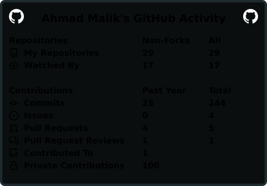
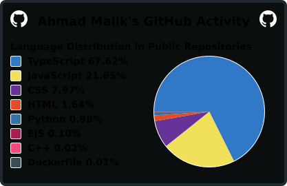
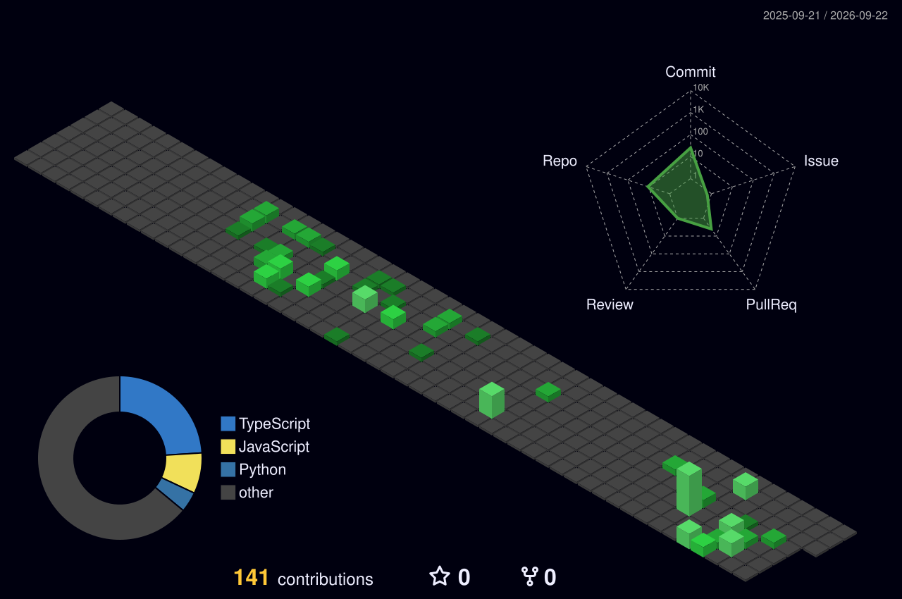

<div align="center">


<a href="https://github.com/Malik-AhmadSE">
  
</a>

<br/>


</div>

<br/>

## `$` whoami

```yaml
role:      Software Engineer
stack:     MERN (MongoDB · Express · React · Node)
domains:   Machine Learning · Automated Trading Bots · Financial Research
currently: { building: "strategy backtester", learning: "reinforcement learning for execution" }
reach_me:  { email: "malikahmadse@gmail.com", linkedin: "https://www.linkedin.com/in/ahmad-ali-malik" }
```

<br/>

## `$` cat now.md

- 🔭 **Building:** a systematic strategy backtester with realistic slippage/fee modeling
- 🧪 **Researching:** reinforcement learning for trade execution timing
- 📚 **Learning:** deeper statistical methods for signal validation
- 🎯 **2026 goal:** ship one strategy from research → paper trading → live, end to end
- 💬 **Ask me about:** MERN architecture, ML pipelines, or backtesting pitfalls

<br/>

<div align="center">

### 📈 Commit Ticker — Signature Chart


<sub>Hand-built from raw GitHub contribution data — green candles on up-days, red on down-days, no third-party rendering service involved.</sub>

</div>

<br/>

<div align="center">

<table border="0">
<tr>
<td valign="top" width="50%">



</td>
<td valign="top" width="50%">



</td>
</tr>
</table>


</div>

<br/>


### 🧊 Contribution Grid — 3D



</div>

<br/>

## `$` cat featured-builds.md

<table>
<tr>
<td width="33%" valign="top">

**⚡ Strategy Backtester**
<br/><sub>Python · pandas · ccxt</sub>

Event-driven backtesting engine for evaluating trading strategies against historical OHLCV data before they touch real capital.

</td>
<td width="33%" valign="top">

**🧠 Signal Research**
<br/><sub>Python · scikit-learn · PyTorch</sub>

Feature engineering and model experiments turning raw market data into usable trade signals.

</td>
<td width="33%" valign="top">

**🌐 MERN Applications**
<br/><sub>React · Node · MongoDB</sub>

Full-stack products spanning dashboards, internal tools, and client-facing apps.

</td>
</tr>
</table>

<sub>Replace the three cards above with your actual flagship repos — this is hand-written context a stats card can't generate on its own.</sub>

<br/>

## `$` tail -f recent-activity.log

<!--START_SECTION:activity-->
1. 🎉 Merged PR [#2](https://github.com/mwaris390/stublab-v2/pull/2) in [mwaris390/stublab-v2](https://github.com/mwaris390/stublab-v2)
2. 💪 Opened PR [#2](https://github.com/mwaris390/stublab-v2/pull/2) in [mwaris390/stublab-v2](https://github.com/mwaris390/stublab-v2)
<!--END_SECTION:activity-->

<br/>

</div>

<br/>

### `$` tech --stack

<div align="center">


</div>

<br/>

<div align="center">

### 🐍 Commit Snake

<!-- Requires the GitHub Action in snake.yml — see setup instructions -->


</div>

<br/>

<div align="center">


<br/><br/>

<a href="https://linkedin.com/in/your-handle"></a>
<a href="mailto:you@example.com"></a>

<br/><br/>


</div>
